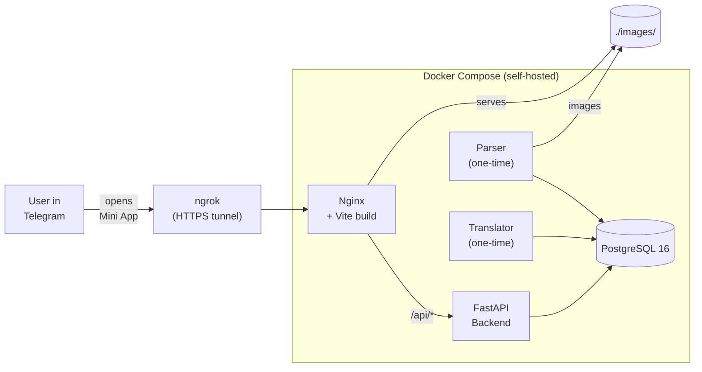
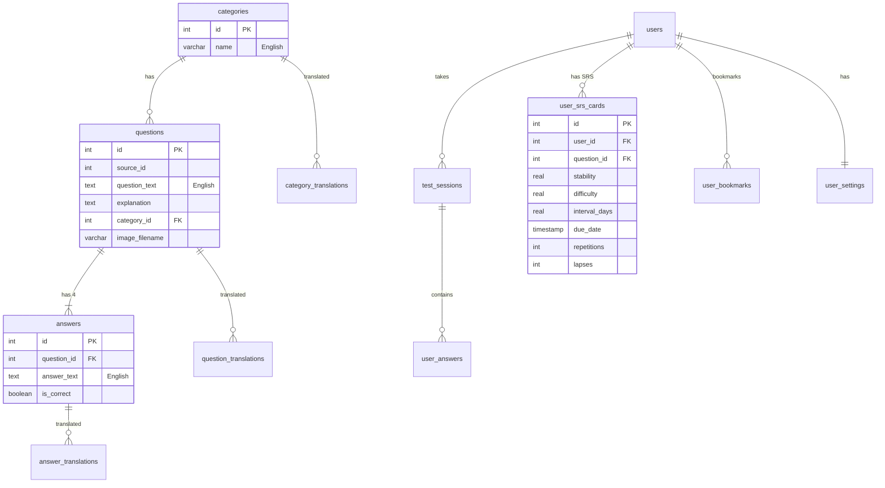

# 🇮🇪 Ireland Driver Theory Test — Telegram Mini App

A **Telegram Mini App** for preparing for the Irish Driving Theory Test. 805 real questions parsed from [theory-tester.com](http://theory-tester.com), with full Russian translation, spaced repetition for mistakes, and four test modes — all inside Telegram.

## Architecture



## Key Features

| Mode | Description |
|------|-------------|
| **Exam** | 40 random questions, timed (30-45 min configurable), pass ≥ 35/40 |
| **Marathon** | All 805 questions with instant feedback |
| **Incorrect** | SRS-powered review of your mistakes |
| **Category** | Practice by topic in batches of 20 |

- 🌐 Full Russian translation (UI + questions) via DeepL API
- 🔖 Bookmarks — save and test individual questions
- 📊 Progress dashboard with accuracy stats
- 🎨 Auto theme sync with Telegram (+ manual dark/light)
- 📳 Haptic feedback on answers

## Tech Stack

| Layer | Technology |
|-------|-----------|
| Database | PostgreSQL 16 |
| Backend | FastAPI + asyncpg |
| Frontend | Vite + Vanilla JS |
| Proxy | Nginx |
| Auth | Telegram initData HMAC → JWT |
| Translation | DeepL API (one-time, stored in DB) |
| SRS | FSRS-Lite (custom, see below) |

## Database Schema

13 tables across 4 domains: **Content**, **Translations**, **Users**, and **Tracking**.



## Spaced Repetition: FSRS-Lite

### How it works

Every wrong answer creates an SRS card with **stability** (days until ~90% forgetting) and **difficulty** (1-10):

```
WRONG answer → stability *= 0.5, difficulty += 0.5, interval = 1 day
CORRECT answer → difficulty -= 0.3, stability grows, interval = stability × 0.9
Mastered = interval ≥ 30 days
```

Example progression (starting difficulty=5.0):

| Review | Result | Interval | Status |
|--------|--------|----------|--------|
| 1 | ✅ | 1 day | learning |
| 2 | ✅ | 3 days | learning |
| 3 | ❌ | 1 day | reset |
| 4 | ✅ | 1.5 days | recovering |
| 5 | ✅ | 5 days | growing |
| 6 | ✅ | 16 days | almost there |
| 7 | ✅ | 52 days | **mastered** ✅ |

## Setup

### Prerequisites
- Docker & Docker Compose
- ngrok account (free tier works)
- Telegram Bot Token (via [@BotFather](https://t.me/BotFather))

### Quick start

```bash
# 1. Clone and configure
cp .env.example .env
# Edit .env: set BOT_TOKEN, WEBAPP_URL, DEEPL_API_KEY

# 2. Start database
docker compose up -d db

# 3. Parse questions (one-time)
docker compose --profile parser up parser

# 4. Translate to Russian (one-time)
docker compose --profile translator up translator

# 5. Start the app
docker compose up -d backend frontend

# 6. Create HTTPS tunnel
ngrok http 80

# 7. Update WEBAPP_URL in .env with ngrok URL, then:
docker compose restart backend
```

### Environment variables

| Variable | Description |
|----------|-------------|
| `BOT_TOKEN` | Telegram bot token |
| `WEBAPP_URL` | Public HTTPS URL (ngrok) |
| `POSTGRES_DB` | Database name (default: `driver_test`) |
| `POSTGRES_USER` | DB user (default: `botuser`) |
| `POSTGRES_PASSWORD` | DB password |
| `DEEPL_API_KEY` | DeepL Free API key |

## License

Private project.
